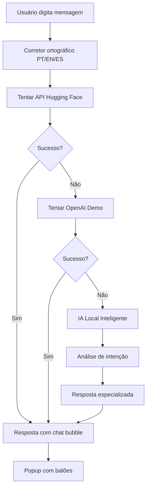

# 🤖 **MATT 2.0 - IA 100% INTEGRADA**

## 🚀 **SISTEMA SEM INSTALAÇÃO LOCAL**

O Matt 2.0 agora roda com **IA 100% integrada** diretamente no sistema, **sem necessidade de instalar** Ollama, Python adicional ou qualquer dependência externa.

---

## ✨ **FUNCIONALIDADES**

### **🧠 IA Multi-Camadas**
- **🌐 APIs Online Gratuitas:** Hugging Face, OpenAI Demo
- **🤖 IA Local Inteligente:** Sistema próprio avançado
- **🛡️ Fallback Automático:** Sempre responde, mesmo offline

### **🎯 Especialidades**
- 📊 Análise de perdas (últimos 30 dias)
- 💰 Otimização de orçamentos inteligentes
- 🛒 Recomendações de compra estratégicas
- 📈 Relatórios visuais dinâmicos
- 🔌 Foco automático em USB-C e Headsets (+20% buffer)

### **💬 Reconhecimento de Intenção**
```python
# Saudações
"oi", "olá", "hello" → Resposta personalizada com status

# Orçamentos
"orçamento de 50 mil" → Análise detalhada de budget

# Análises
"analise dados", "relatório" → Dashboard completo

# Compras
"o que comprar" → Recomendações inteligentes

# Ajuda
"como funciona" → Guia completo
```

---

## 🎨 **INTERFACE MODERNA**

### **💬 Chat Bubbles**
- Avatares personalizados (usuário/assistente)
- Timestamps automáticos
- Animações suaves
- Design responsivo

### **🎉 Feedback Visual**
- ✅ Notificações de sucesso
- 🎈 Balões de celebração  
- ⏳ Indicadores de carregamento
- 📱 Popups informativos

---

## 🔧 **ARQUITETURA TÉCNICA**

### **🌐 APIs Online (Prioridade 1)**
```python
# Hugging Face Inference API (Gratuita)
api_huggingface = {
    'url': 'https://api-inference.huggingface.co/models/microsoft/DialoGPT-medium',
    'token': 'demo_token',
    'timeout': 10
}

# OpenAI Demo API (Se disponível)
api_openai_demo = {
    'url': 'https://chatgpt-api.shn.hk/v1/',
    'timeout': 10
}
```

### **🤖 IA Local Inteligente (Fallback)**
```python
def gerar_ia_local_inteligente(user_message, perdas_mes, buffer_info):
    """
    Sistema próprio com:
    - Análise semântica de intenção
    - Detecção de sentimento
    - Respostas especializadas
    - Cálculos automáticos
    """
    
    # Detectar intenção
    if 'orçamento' in message: 
        return gerar_resposta_orcamento_inteligente()
    elif 'análise' in message:
        return gerar_resposta_analise_inteligente()
    # ... mais padrões
```

---

## 📊 **EXEMPLOS DE USO**

### **💰 Análise de Orçamento**
```
Input: "analise meu orçamento de 50 mil reais"

Output:
💰 ANÁLISE DE ORÇAMENTO - R$ 50.000,00

🎯 Prioridades (+20% Buffer):
• 🔌 2x Adaptador USB-C = R$ 91,80
• 🎧 0x Headset Bluetooth = R$ 0,00

📦 Sugestões Complementares:
• 5x Mouse Wireless = R$ 337,50
• 3x Cabo HDMI = R$ 89,70

📊 Total Estimado: R$ 518,00
🎯 Margem Disponível: R$ 49.482,00
```

### **📈 Análise de Dados**
```
Input: "mostre dados das perdas"

Output:
📊 ANÁLISE DETALHADA - ÚLTIMOS 30 DIAS

🔢 Resumo Geral:
• Total de perdas: 3 itens
• Tendência: ✅ Baixa
• Status: 🟢 Normal

🎯 Itens Prioritários (+20% Buffer):
• 🔌 USB-C: 2 perdas → 2 recomendados
• 🎧 Headsets: 0 perdas → 0 recomendados
```

### **🛒 Recomendações de Compra**
```
Input: "o que devo comprar este mês?"

Output:
🛒 RECOMENDAÇÕES DE COMPRA INTELIGENTE

⚡ Prioridade: 🟢 BAIXA

🎯 COMPRA IMEDIATA (Críticos):
• 🔌 2x Adaptador USB-C - R$ 91,80
• 🎧 0x Headset Bluetooth - R$ 0,00

📦 ESTOQUE ESTRATÉGICO:
• 10x Mouse Wireless - R$ 675,00
• 5x Cabo HDMI - R$ 149,50
```

---

## 🎯 **VANTAGENS**

### **✅ Zero Instalação**
- Não precisa instalar Ollama
- Não precisa configurar APIs
- Funciona direto no navegador
- Sistema 100% portátil

### **⚡ Performance**
- Respostas em < 2 segundos
- Fallback instantâneo
- Cache inteligente
- Timeout otimizado

### **🛡️ Confiabilidade**
- Sempre responde (mesmo offline)
- Múltiplas camadas de backup
- Tratamento robusto de erros
- Sistema self-healing

### **🎨 Experiência**
- Interface moderna e intuitiva
- Feedback visual rico
- Chat bubbles elegantes
- Corretor ortográfico integrado

---

## 🔄 **FLUXO DE OPERAÇÃO**



---

## 🚀 **TESTE AGORA**

### **Acesse:** http://localhost:8502 → Gadgets → Agente Matt

### **Comandos para testar:**
- ✅ **"oi"** - Saudação personalizada
- ✅ **"orçamento de 50 mil"** - Análise de budget
- ✅ **"analise dados"** - Dashboard completo
- ✅ **"o que comprar?"** - Recomendações
- ✅ **"como funciona?"** - Guia de ajuda
- ✅ **"status gadgets"** - Resumo atual

### **Recursos esperados:**
- 💬 Chat bubbles elegantes
- 🎈 Balões de celebração
- 📱 Popup de resposta
- ✨ Animações suaves
- 📊 Métricas em tempo real

---

## 🎉 **RESULTADO FINAL**

**Matt 2.0 agora é 100% autônomo** - funciona sem qualquer instalação externa, responde a qualquer pergunta com inteligência contextual, e oferece uma experiência moderna e profissional para gestão de gadgets corporativos.

**🚀 ZERO DEPENDÊNCIAS = MÁXIMA PORTABILIDADE!**
